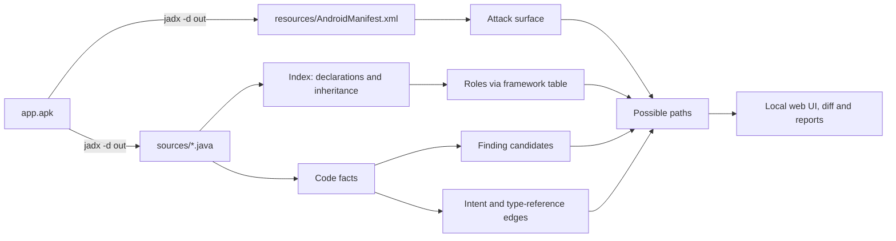

# JADX Atlas

[](https://github.com/Rafawaldrigues/jadx-atlas/actions/workflows/ci.yml)

[](LICENSE)

Attack-surface map for Android apps, built on JADX output.

Given a JADX export, JADX Atlas shows which components are exposed, what each class is (Activity,
TrustManager, WebViewClient and so on, even when the name is `a.b.c`), where sensitive APIs are used,
how screens launch each other, and possible paths from an exposed entry point to the code worth reviewing.
It runs locally, and each result includes its confidence and the file and line it is based on.

It is meant for people who already read apps in JADX and want a faster way to decide where to look first.

## Quick start

Requires Python 3.10 or newer.

```bash
python3 -m venv .venv && . .venv/bin/activate
pip install -e .
jadx-atlas
```

Your browser opens a demo app. To analyse a real app, export it with JADX (keep the resources, so the
manifest is included) and open the folder:

```bash
jadx -d app-out app.apk
jadx-atlas app-out
```

`./start.sh` does the install steps for you. The address printed in the terminal includes a per-run
session token; open that exact address.

## Compared with other tools

Atlas complements these tools rather than replacing them:

| Tool | What it does best | What Atlas adds |
|---|---|---|
| [MobSF](https://github.com/MobSF/Mobile-Security-Framework-MobSF) | All-in-one static and dynamic analysis with a broad set of checks and reports, starting from the APK. | A navigable map of the decompiled code: findings tied to inheritance roles, Intent edges and paths from the exposed entry, with explicit confidence levels. Lightweight: works from an existing JADX export, no services to run. |
| [Drozer](https://github.com/WithSecureLabs/drozer) | Interacting with exported components on a device or emulator (sending Intents, querying providers). | Static and offline. It tells you which components, deep links and paths are worth trying with Drozer. |
| JADX GUI and plugins such as `jadx-type-diagram-plugin` | Decompilation, code search and (with the plugin) type diagrams inside JADX. | Manifest-aware attack surface, roles through obfuscation, rule-based finding candidates, an Intent graph, version diffs and exportable reports. |

## How it works



Java declarations are parsed with Tree-sitter, never with regular expressions. Names are resolved through
scope, imports and packages and are never joined by short name, so uncertain links stay marked as such.
Design details are in [docs/DESIGN.md](docs/DESIGN.md); the checks against independent references
(`aapt2`, real AndroidX code, an R8-obfuscated build) are in [docs/VALIDATION.md](docs/VALIDATION.md).

## Features

### Attack surface

Reads `resources/AndroidManifest.xml` (or `--manifest <file>`) as hostile input and links every component
to its class:

- Effective export and the reason for it, following the AOSP rules: explicit, implicit through an
  intent-filter (targetSdk < 31), old provider default (targetSdk < 17), and so on.
- Values that cannot be known statically (`exported="@bool/…"`, inconsistent manifests) are reported as
  *unknown*, together with a guess and where it came from, and shown as "potentially exported".
- Permissions (including the one inherited from `<application>`), `protectionLevel` of the app's own
  permissions, providers judged by their weakest side, and deep links.
- App alerts: `debuggable`, `allowBackup`, `usesCleartextTraffic`, `testOnly`.

### Roles from inheritance

Each class gets roles such as Activity, Service, Receiver, Provider, Application, Fragment, TrustManager,
HostnameVerifier, WebViewClient, WebChromeClient, SSLSocketFactory, AsyncTask, Parcelable and
Serializable from its ancestor chain, through obfuscated names (`a.b.c (Activity)`) and through
AndroidX, the support library and Firebase. The chain continues through a framework table generated with
`javap` from official artifacts. Each role shows the path it followed and its confidence, and declared
components are cross-checked against it.

### Finding candidates

30 data-driven rules (`atlas/data/rules/*.json`) flag code that often indicates a problem:

- **WebView:** JavaScript, native bridges, file access, debugging, dynamic `loadUrl`.
- **TLS:** empty TrustManager, HostnameVerifier that accepts everything, `onReceivedSslError` calling `proceed()`, legacy protocols.
- **Crypto:** ECB, DES/RC4, MD5/SHA-1, literal keys, IVs and seeds.
- **Execution:** `Runtime.exec`, `ProcessBuilder`, `DexClassLoader`, reflection.
- **Storage and IPC:** `MODE_WORLD_*`, concatenated SQL, mutable `PendingIntent`, broadcasts without a permission, Intent data read in exported components.
- **Secrets:** known formats, high-entropy literals, `http://` URLs.

Each rule documents its known false positives and official references. There is no type inference, so
confidence is graded:

- `high`: the receiver's declared type resolves, through the file's imports, to the API class and the method matches;
- `medium`: the method matches and the file imports the API, but the receiver type could not be determined;
- `low`: only the method name matches, or an argument could not be evaluated.

Receivers of another type are discarded. Code in anonymous classes is attributed to the enclosing class.
Secrets are always masked (`AKIA…[20 chars]`).

### Intents and possible paths

Screens and components are linked through `startActivity`, `startService`, `bindService`,
`sendBroadcast`, `PendingIntent.get*` and `registerReceiver`, with targets from `X.class`,
`setClassName`, `setComponent` or implicit actions matched against the manifest's intent filters.
Intents that cannot be traced are listed as unresolved, with the reason, instead of becoming edges.

The Paths tab finds routes from an exposed entry (exported component, deep link, Application) to
classes with finding candidates, through Intent edges, type references and, optionally, inheritance:
shortest first, with depth, count and time limits, deterministic order and file:line evidence for every
step. A path is a possible route, not proof of reachability or exploitability.

### Version diff

```bash
jadx-atlas diff app-v1/sources app-v2/sources --format md --out diff.md --fail-on exported-added,permission-added
```

Shows what changed in the attack surface: new or removed components, `exported` going from `false` to
`true`, permissions, deep links, `<application>` flags, new and removed finding candidates (identity does
not depend on line numbers) and component inheritance. Renamed obfuscated classes are paired only as
*possible matches*. With `--fail-on`, the exit code is 2 when such a change appears, which is useful in
CI. In the UI, use **Compare versions**.

### Reports

```bash
jadx-atlas export app-out --format md --out report.md --apk app.apk
```

Produces a write-up skeleton with:

- traceability: tool version, date, SHA-256 of the manifest and, with `--apk`, of the APK;
- app data, the attack-surface table and finding candidates by severity, with evidence;
- possible paths, methodology and limitations;
- sections for the analyst to fill in.

`--format json` exports the full index in the format of
[docs/schema/atlas-index.schema.json](docs/schema/atlas-index.schema.json). Secrets stay masked
(`--include-secrets` to include them, carefully), and `--anonymize` replaces the app's package, class
names and hosts with stable identifiers, so you can share a report without exposing the target. The
folder's absolute path is never exported.

### Obfuscated code

- The status bar estimates obfuscation. With `jadx --deobf`, the `renamed from` and `compiled from` comments become searchable aliases.
- Global search (3 or more characters) also looks in roles, rules and string literals, including URLs.
- Hide libraries hides known library prefixes and the ones you add, but never the app's own package.
- Group packages collapses the map to one node per package.
- Your aliases, tags and notes are stored in your user data directory (for example `~/.local/share/jadx-atlas`), never inside the analysed folder.

### Navigating the map

- Overview shows the whole project; Class focus shows 1 to 5 levels around the selected class, and
  Full hierarchy removes the limit. The Inheritance / Intents / All buttons choose which edges are drawn.
- Click a class to inspect it: declaration, roles, component data, finding candidates, Intents, type
  references and your notes. Click the file name to read the code with the line highlighted.
- Keyboard: `/` search, `+`/`-` zoom, `0` fit, arrows move, `C` centre the selection, `H` full
  hierarchy, `R` root class.
- Exposure, severity and edge kinds are shown with shapes, letters and line styles as well as colour.

## Performance

Measured with `scripts/bench.py` on a 16-thread machine with Python 3.14:

| Project | Types | Serial | Parallel (8 processes) | Cached re-run |
|---|---|---|---|---|
| AndroidX + support library + Firebase, decompiled with JADX | 2,032 | 1.8 s | 1.0 s | 0.4 s |
| Synthetic (`scripts/gen_large_project.py`, empty class bodies) | 50,000 | 8.7 s | 5.1 s | 7.3 s |

Parsing uses several processes from 300 files on (`--workers N` to adjust, `--workers 1` to disable). A
per-file cache is kept in `~/.cache/jadx-atlas` (`--no-cache` to disable); it pays off on real code,
where parsing is expensive. The map draws at most 600 nodes per view; search, package filters and focus
reach the rest. Projects whose index exceeds `ATLAS_MAX_PAYLOAD_MB` (150 by default) are not loaded into
the browser; the CLI and the on-demand API (`/api/list`, `/api/neighbors`, `/api/search`) still work.

## Limitations

- No data-flow or interprocedural analysis. Intent tracking is intra-method; paths are possible
  routes, not proof.
- Findings are candidates for manual review. Confidence levels describe how much of the match was
  confirmed, not whether the issue is exploitable.
- Not analysed: native code, original Kotlin, Smali, resources other than the manifest, split APKs (only
  the base manifest) and run-time behaviour. Reflection and dynamic code loading hide real flows.
- Inherited member types and some complex import/scope cases may stay unresolved; they are marked as such.
- The UI does not yet have a neighbourhood-only mode for projects above the payload limit.

## Command-line reference

```text
jadx-atlas [serve] [PATH] [--port N] [--no-browser] [--manifest FILE] [--workers N] [--no-cache] [--verbose]
jadx-atlas diff OLD NEW [--format md|json] [--out FILE] [--fail-on CATEGORIES]
jadx-atlas export PATH [--format md|json] [--out FILE] [--manifest FILE] [--apk FILE] [--anonymize] [--include-secrets]
```

The server only listens on `127.0.0.1`, requires the per-run session token on `/api/` routes, validates
`Host` and `Origin`, and uses a strict Content Security Policy. `--verbose` logs each request as one JSON
line (route, status, time; never the query string or code).

## Development

```bash
pip install -e '.[dev]'
python -m unittest discover -s tests -v
ruff check . && ruff format --check .
npm run check          # front-end syntax and node --test
```

- The JADX end-to-end test runs when `javac`, `jadx` and the Android SDK are available;
  `python scripts/build_test_apk.py [--obfuscate]` builds the test APK.
- `python scripts/gen_large_project.py --classes 20000` generates a synthetic project in `artifacts/` (ignored by Git).
- `python scripts/framework_hierarchy.py --check` re-verifies the framework table against `javap`.
- To refresh the vendored front-end libraries: `npm ci && npm run vendor`.

Layout:

- `atlas/`: indexer, manifest, roles, rules, Intents, paths, diff, report, server and CLI;
- `atlas/web/`: UI; `atlas/data/`: rules and framework tables; `atlas/examples/`: demo app;
- `scripts/`: generators and tools; `tests/`: tests; `docs/`: design notes, validation, schema.

See [CONTRIBUTING.md](CONTRIBUTING.md) and the [CHANGELOG](CHANGELOG.md).

## Roadmap

- Validate on more real apps (open-source and CTF apps whose licences allow it).
- SARIF output, a neighbourhood-only UI mode for very large apps, UI translations.

## Author and licence

Written by Rafael Guerra Waldrigues de Campos Bueno and released under the [MIT License](LICENSE).

JADX Atlas builds on [JADX](https://github.com/skylot/jadx)
output (it does not bundle JADX), [Tree-sitter](https://tree-sitter.github.io/) and
[tree-sitter-java](https://github.com/tree-sitter/tree-sitter-java), [defusedxml](https://github.com/tiran/defusedxml),
[Cytoscape.js](https://js.cytoscape.org/), [dagre](https://github.com/dagrejs/dagre) and
[cytoscape-dagre](https://github.com/cytoscape/cytoscape.js-dagre). The vendored front-end libraries keep
their MIT licences in `atlas/web/vendor/`. This project is not affiliated with JADX or any of the tools
mentioned above.

## Disclaimer

The developer of this software is not responsible for any unauthorised use of it or for any damage it
may cause.
